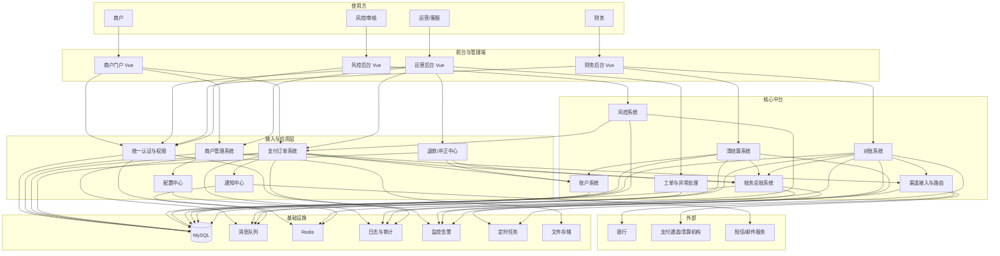

# ToB 法币支付平台系统全景图

## 1. 目标定义

本项目的长期目标是建设一套可企业级上线的 `ToB 法币支付平台`，当前范围如下：

- 后端技术栈：`Java`
- 前端技术栈：`Vue`
- 交付形态：以网页管理端和商户门户为主
- 当前阶段：暂不对外开放 API
- 业务方向：法币支付，不讨论加密货币
- 面向对象：企业商户、平台运营、财务、风控、审核人员

这意味着系统设计重点不是官网，而是：

- 交易处理
- 账户与账务
- 清结算
- 对账
- 风控
- 审计与运营支撑

## 2. 系统全景图

## 3. 必建系统清单

### 3.1 面向商户和内部人员的系统

1. 商户门户
   商户查看订单、余额、账单、结算记录、通知消息、资料信息。

2. 运营后台
   内部运营查询订单、人工处理异常、审核商户、管理渠道和配置。

3. 财务后台
   财务查看结算批次、对账结果、差错处理、调账记录。

4. 风控与审核后台
   风控人员查看预警、审核规则命中、处理黑白名单和人工复核。

### 3.2 核心交易与资金系统

1. 商户管理系统
   管理商户资料、结算账户、费率、产品权限、限额和审核流程。

2. 支付订单系统
   管理支付单、退款单、冲正单、状态机、幂等、超时、重试和回执。

3. 渠道接入与路由系统
   对接银行和通道，管理报文转换、路由规则、可用性切换和限流。

4. 账户系统
   维护商户可用余额、冻结余额、待结算余额等业务账户视图。

5. 账务总账系统
   使用双分录或借贷记账，记录不可篡改的账务流水和凭证。

6. 清结算系统
   计算应结金额、手续费、成本、分润、补贴和结算周期。

7. 对账系统
   核对平台内部订单、账务流水、银行流水、渠道流水，输出差异结果。

8. 风控系统
   负责限额、频控、黑白名单、风险分级、异常交易预警和止损。

9. 工单与异常处理系统
   用于掉单、长短款、状态不一致、人工复核和内部流转。

### 3.3 基础支撑系统

1. 统一认证与权限系统
2. 配置中心
3. 通知中心
4. 审计日志系统
5. 监控告警系统
6. 定时任务调度系统
7. 文件与证照存储系统

## 4. 建设优先级

### P0：从 0 到 1 必须先做

1. 商户管理系统
2. 商户门户
3. 运营后台
4. 支付订单系统
5. 渠道接入与路由系统
6. 账户系统
7. 账务总账系统

### P1：进入真实运营前必须补齐

1. 清结算系统
2. 对账系统
3. 风控系统
4. 通知中心
5. 统一认证与权限
6. 审计日志
7. 监控告警

### P2：规模化经营需要增强

1. 工单系统
2. 多法人主体支持
3. 多银行、多通道、多清算策略
4. 费率模板和产品编排
5. 更完善的报表中心
6. 灰度与高可用治理能力

## 5. 企业级上线版本应该达到什么程度

一个能真实上线的企业级版本，不等于功能多，而是以下能力必须过关：

### 5.1 业务正确性

- 核心状态流转清晰
- 订单幂等
- 账实一致
- 账务可追溯
- 差错可处理
- 结算可复算

### 5.2 稳定性

- 核心链路支持重试和补偿
- 关键操作可审计
- 通道失败可切换
- 异步任务可恢复
- 有基础限流和熔断

### 5.3 合规与内控

- 商户准入资料留痕
- 关键配置变更审批
- 敏感操作操作日志
- 财务调账严格留痕
- 登录与权限分级

### 5.4 工程能力

- 分环境配置
- CI/CD
- 自动化测试
- 数据库变更规范
- 接口与事件契约管理
- 完整监控和告警

## 6. 推荐分阶段落地

### 阶段一：MVP

目标是先跑通一条最小闭环：

- 商户入驻
- 商户登录
- 创建支付订单
- 调用单一渠道
- 订单回写
- 入账
- 简单结算
- 商户查询账单

建议时间：`2 到 3 个月`

适合团队：

- 后端 `2 到 3` 人
- 前端 `1` 人
- 测试 `1` 人
- 产品/项目 `1` 人

### 阶段二：可运营版本

补齐以下能力：

- 退款与冲正
- 对账
- 财务结算批次
- 风控基础规则
- 审计日志
- 告警监控
- 运营后台完善

建议时间：`4 到 6 个月`

### 阶段三：企业级首发版本

补齐以下能力：

- 多渠道路由
- 更完整的账务科目体系
- 工单与异常闭环
- 审批流
- 更细颗粒度权限
- 压测与容灾
- 安全加固

建议时间：`6 到 12 个月`

## 7. 如果由我持续协助，能帮到什么程度

可以长期协助以下工作：

- 业务域拆分
- 系统边界设计
- 数据库模型设计
- Java 后端代码实现
- Vue 前端管理台实现
- 接口定义
- 账务模型设计
- 清结算流程设计
- 风控规则抽象
- 权限模型设计
- 测试用例设计
- 文档沉淀

但要注意：

- 我可以帮你把系统设计和代码逐步做出来
- 我可以持续作为架构、研发和文档搭档
- 我不能替代真实的牌照、法务、合规、审计和银行合作工作

## 8. 推荐的初始技术路线

在项目早期，推荐使用 `模块化单体`，不要一开始上重型微服务。

### 后端建议模块

- `merchant-service`
- `portal-service`
- `ops-service`
- `order-service`
- `channel-service`
- `account-service`
- `ledger-service`
- `settlement-service`
- `reconciliation-service`
- `risk-service`
- `support-service`
- `auth-service`

### 基础设施建议

- 数据库：`MySQL`
- 缓存：`Redis`
- 消息队列：`RabbitMQ` 或 `Kafka`
- 对象存储：本地兼容实现或云存储
- 日志：`ELK` 或兼容方案
- 监控：`Prometheus + Grafana`

## 9. 当前仓库建议的下一步

当前仓库还是留言板 Demo，不适合作为支付系统直接扩展。

建议下一步按以下顺序演进：

1. 先把项目改造成 `frontend + backend + docs` 的正式结构
2. 在后端建立支付平台基础骨架工程
3. 先实现 `认证、商户管理、订单、账户、账务` 五个最核心模块
4. 再做 `门户和运营后台`
5. 最后逐步补齐 `清结算、对账、风控`
